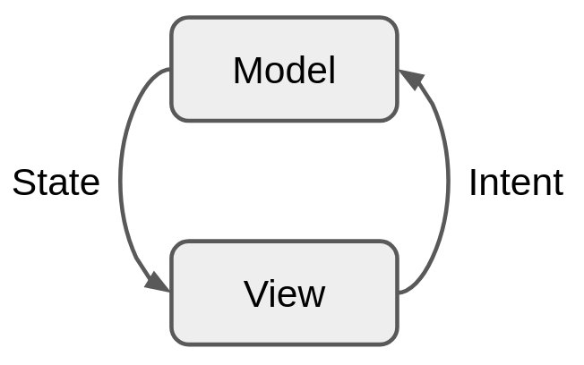

[](https://bintray.com/badoo/maven/reaktive/_latestVersion)
[](https://github.com/arkivanov/MVIKotlin/blob/master/LICENSE)

## MVIDroid to MVIKotlin transition
The library was recently converted to Kotlin Multiplatform. The name of the library 
was also changed to MVIKotlin, from my point of view it works better for the new format.
The previous versions of MVIDroid (Android only) are still available though. You can
find MVIDroid README [here](docs/mvidroid/README.md), and docs [here](docs/mvidroid/docs/index.md).

## What is MVIKotlin
MVIKotlin is a Kotlin Multiplatform framework that provides a way of (not only) writing
shared code using MVI pattern. It also includes powerful debug tools like
logging and time travel. The main functionality of the framework does not depend on any
reactive nor coroutines library. Extensions for [Reaktive](https://github.com/badoo/Reaktive)
and for [Coroutines](https://github.com/Kotlin/kotlinx.coroutines) libraries are 
provided as separate modules.  



## Setup
Recommended minimum Gradle version is 5.3. Please read first the documentation about
[metadata publishing mode](https://kotlinlang.org/docs/reference/building-mpp-with-gradle.html#experimental-metadata-publishing-mode).

Add Bintray repository into your root build.gradle file:
```groovy
repositories {
    maven {
        url  "https://dl.bintray.com/arkivanov/maven"
    }
}
```

There are a number of modules published:
- `mvikotlin` - core interfaces and functionality (multiplatform)
- `mvikotlin-main` - the main module with the default `Store` implementation (mutiplatform)
- `mvikotlin-logging` - logging functionality (mutiplatform)
- `mvikotlin-timetravel` - time travel feature (mutiplatform)
- `mvikotlin-extensions-reaktive` - extensions set for Reaktive library (multiplatform)
- `mvikotlin-extensions-coroutines` - extensions set for coroutines (multiplatform)
- `rx` - a tiny module with abstractions over rx and coroutines (multiplatform)

Add required modules to your module`s build.gradle file:
```groovy
implementation "com.arkivanov.mvikotlin:<module-name>:<version>"
```

## Features
* Multiplatform: Android, JVM, JavaScript, iosX64, iosArm64, linuxX64
* Does not depend on any reactive library or coroutines
* Extensions for [Reaktive](https://github.com/badoo/Reaktive) library
* Extensions for [Coroutines](https://github.com/Kotlin/kotlinx.coroutines)
* Multithreading friendly (freezable in Kotlin Native if needed)
* Logging functionality with adjustable verboseness and ability to provide custom logger
* Time travel feature:
  * Multiplatform for all supported targets
  * Plug-and-play UI for Android
  * Plug-and-play UI for iOS (copy-paste from the sample app)
  * Export/import events for JVM and Android

## Documentation

Coming soon, the code is documented though.

## Sample project

The sample project is a todo list with details view.
* Shared module using Reaktive is [here](sample/todo-reaktive)   
* Shared module using coroutines is [here](sample/todo-coroutines)
* Sample Android application with both Reaktive and coroutines implementations, plus logging and time travel is [here](sample/todo-app-android)
* Sample iOS application with Reaktive implementation only, plus logging and time travel is [here](sample/todo-app-ios)   

## Author
Twitter: [@arkann1985](https://twitter.com/arkann1985)

## Watch video (time travel, logs, debug, etc.)

#### Debugging Android application with MVIKotlin
[](https://youtu.be/_bbxR503-u0)

#### Debugging iOS application with MVIKotlin
[](https://youtu.be/MJCYQzeL-w8)

